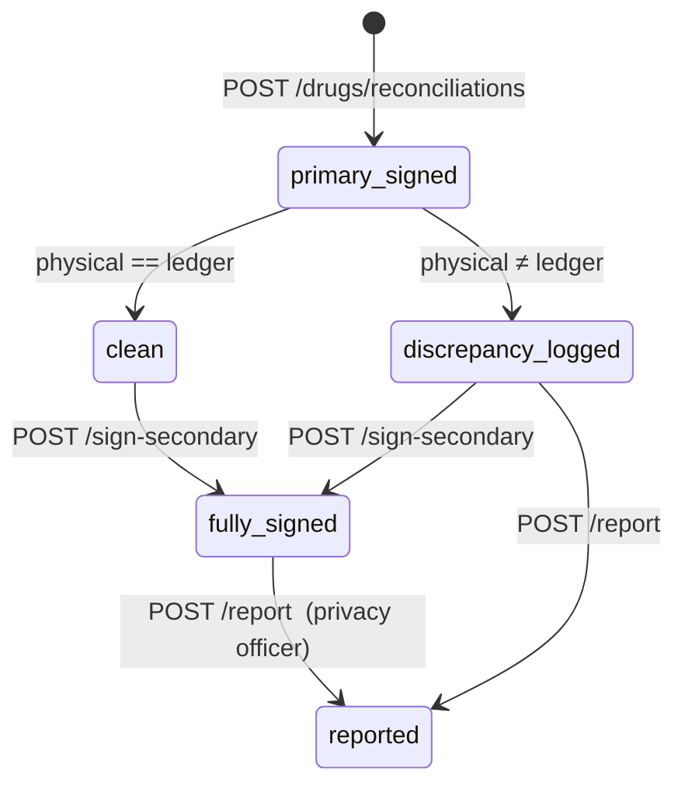

# Drugs Module

A clinic's full controlled-drug + medication workflow: a static **catalog** of
drugs (per vertical × country), a per-tenant **shelf** that holds physical
inventory, an append-only **operations ledger**, and **reconciliation** events
that close out a counting period with two-staff signoff.

The module is designed around a "game inventory" mental model:

```
catalog (read-only data)        shelf (per-clinic stock)        operations (ledger)
   ┌───────────────┐               ┌──────────────────┐           ┌──────────────────┐
   │ Ketamine      │               │ Ketamine 100mg/mL│           │ administer 1 mL  │
   │ Methadone     │ → add to →    │  batch K-2026-04 │ → log →   │ administer 0.5 mL│
   │ Morphine      │               │  loc=cd-safe     │           │ receive   10 mL  │
   │ …             │               │  balance=4.5 mL  │           │ discard   0.2 mL │
   └───────────────┘               └──────────────────┘           └──────────────────┘
                                                                            │
                                                                  reconciliation locks
                                                                  every op in [start,end]
```

**No AI runs on the drug register** — too much regulator weight. Witness
checks, balance checks, and reconciliation statuses are all deterministic.

## Domain split

| Layer        | Where                                        | Source of truth                         |
|--------------|----------------------------------------------|-----------------------------------------|
| Catalog      | `internal/drugs/catalog/*.json` (embed.FS)   | Ships with the binary; immutable per deploy |
| Overrides    | `clinic_drug_catalog_overrides` table        | Per-clinic custom drugs (compounded etc.) |
| Shelf        | `clinic_drug_shelf` table                    | Live inventory per (drug × strength × batch × location) |
| Operations   | `drug_operations_log` table                  | Append-only ledger. UPDATEs forbidden — corrections via `addends_to` chain |
| Reconciliation | `drug_reconciliation` table                | Period-close + two-staff signoff |

## Catalog

The catalog is split per `(vertical, country)` — 16 combos shipped:

```
vet|dental|general|aged_care   ×   NZ|AU|UK|US
```

Each file (`vet_NZ.json`, `aged_care_UK.json`, …) is parsed at startup and
stored in a `Loader` indexed on `vertical:country`. Adding a new combo only
needs a new JSON file in `internal/drugs/catalog/` — the loader picks it up
automatically.

### Vertical aliases

The catalog uses short verticals (`vet`, `general`) but the rest of the
codebase uses the canonical clinic strings (`veterinary`, `general_clinic`).
`catalog.normalizeVertical()` translates inside `keyFor()` so the long form
works at every public method on the loader. Tests guard the alias to prevent
the empty-catalog regression.

### Schedule semantics

Schedule labels are stored as opaque strings — the regulator naming differs
by country and overlaps between countries:

| Country | Controlled labels in catalogs |
|---------|------------------------------|
| NZ      | `S1`, `S2`, `S3` (Misuse of Drugs Act 1975) |
| AU      | `S8` (Schedule 8 only is "Controlled Drug") |
| UK      | `CD2`, `CD3` (MDR 2001 schedules requiring register) |
| US      | `CII`, `CIII`, `CIV` (DEA scheduled) |

**Don't parse the schedule string.** The `Controls` struct on each entry
carries the operational rules (`witness_required`, `register_required`,
`storage_restriction_level`) and that's what business logic should depend on.

```go
// Wrong — schedule "S2" means different things in NZ vs AU.
if entry.Schedule == "S2" { /* … */ }

// Right — controls metadata is country-aware by construction.
if entry.RequiresWitness() { /* … */ }
```

## Shelf

A shelf entry is the physical instance of a drug — one row per
`(drug × strength × batch × location)`. Active rows have a `UNIQUE` index on
that tuple; closing one out (archive) lets the same tuple be re-admitted
later without violating the constraint.

Two ways to seed a shelf entry:

| Source         | When to use                                  |
|----------------|----------------------------------------------|
| `catalog_id`   | The drug exists in the system catalog        |
| `override_drug_id` | Compounded product or locally-only entry |

Exactly one of the two must be set — enforced by a `CHECK` constraint and the
service layer. Trying both or neither returns `422`.

The shelf has its own `balance` column kept in sync by the operations
service (transactional `FOR UPDATE` lock). The balance is denormalised on
purpose — recomputing from the ledger on every list call would not scale.

## Operations ledger

Append-only. The schema forbids UPDATEs (only the
`reconciliation_id` column is mutated, by the lock-period flow). Six
operation kinds:

| Op           | Effect on balance | Subject required |
|--------------|-------------------|------------------|
| `administer` | minus quantity    | yes              |
| `dispense`   | minus quantity    | yes              |
| `discard`    | minus quantity    | no               |
| `receive`    | plus quantity     | no               |
| `transfer`   | no change (v1)    | no               |
| `adjust`     | set absolute      | no               |

`adjust` interprets `quantity` as the new absolute balance, not a delta —
clinics use it for stocktake corrections. The reason field MUST explain the
delta; UI enforces this.

### Witness rule

For controlled drugs (where `Controls.WitnessRequired` is true), every
outflow op MUST include a `witnessed_by` staff_id that:

1. Differs from `administered_by` (the cosigner can't be the same person).
2. Holds the `perm_witness_controlled_drugs` permission.

Both checks happen in `service.LogOperation` against the `StaffPermLookup`
adapter. Failure surfaces as `422 ErrValidation` (missing/equal witness) or
`403 ErrForbidden` (missing perm).

### Subject access logging

When an operation references a subject, the service writes a row to
`subject_access_log` via the `SubjectAccessLogger` adapter. Likewise for
listing a subject's drug history (`/drugs/subjects/{id}/medications`). This
is the regulator-visible PII trace.

## Reconciliation

A reconciliation closes out a `(shelf, period)` window. The flow:



`status` is GENERATED in the DB from `physical_count` vs `ledger_count`:

```sql
status TEXT GENERATED ALWAYS AS (
  CASE
    WHEN physical_count = ledger_count THEN 'clean'
    ELSE 'discrepancy_logged'
  END
) STORED
```

Reporting to regulator is a privacy-officer flow that flips the row to
`reported_to_regulator` and stamps `reported_at` / `reported_by`. The
discrepancy row is never deleted.

### Period locking

Starting a reconciliation flips every operation in
`[period_start, period_end]` to carry the new `reconciliation_id`. This is
the only mutation allowed on the operations table after insert — its purpose
is to mark those rows as locked-into-a-closed-period, so future addendums
can be detected and refused at the service layer.

A second reconciliation for the same `(shelf, period_end)` returns
`409 Conflict` (DB UNIQUE).

## API surface

All endpoints under `/api/v1/drugs/*`. Permission gating uses existing
`domain.Permissions` flags:

| Group | Path | Perm |
|-------|------|------|
| Catalog | `GET /catalog`, `GET /catalog/{entry_id}` | any authenticated staff |
| Overrides | `POST/PATCH/DELETE /overrides/…` | `ManagePatients` |
| Shelf | `POST/GET/PATCH/DELETE /shelf/…` | `ManagePatients` |
| Log op | `POST /operations` | `Dispense` |
| List ops | `GET /operations`, `GET /operations/{id}` | `ViewAllPatients` ∪ `ViewOwnPatients` |
| Subject history | `GET /subjects/{id}/medications` | `ViewAllPatients` ∪ `ViewOwnPatients` |
| Reconciliation | `POST/GET /reconciliations…` | `GenerateAuditExport` |

Granular `perm_witness_controlled_drugs`, `perm_dispense_controlled_drugs`,
`perm_manage_drug_shelf` columns exist on `staff` (migration 00062) — these
will replace the coarse mapping in a follow-up once they're wired into the
JWT claims path.

## Service dependencies

The drugs service takes three small interfaces, satisfied by adapters in
`app.go`:

```go
type ClinicLookup interface {
    GetVerticalAndCountry(ctx context.Context, clinicID uuid.UUID) (vertical, country string, err error)
}
type StaffPermLookup interface {
    HasPermission(ctx context.Context, staffID, clinicID uuid.UUID, permName string) (bool, error)
}
type SubjectAccessLogger interface {
    LogAccess(ctx context.Context, clinicID, subjectID, staffID uuid.UUID, action, purpose string) error
}
```

Each adapter wraps a single sister-domain service (`clinic`, `staff`,
`patient`) — the drugs package never imports them directly, preserving the
"call exported service interfaces only" rule.

## What's not done yet

- Granular `perm_dispense_controlled_drugs` / `perm_manage_drug_shelf`
  enforcement on routes (currently uses coarse `domain.Permissions`).
- Override drugs don't carry their own `Controls` metadata — they're treated
  as non-controlled until v2 adds a per-override controls override table.
- `transfer` op currently doesn't decrement the source shelf — v2 will
  support split-row transfer in one transaction.
- Drug events don't yet feed the unified subject timeline endpoint
  (`/api/v1/subjects/{id}/timeline`); the patient hub renders them inline
  via the dedicated `subject_drug_history` cubit.
- VCNZ / DEA / MDR PDF register exports — lives in the Reports module (A4).
