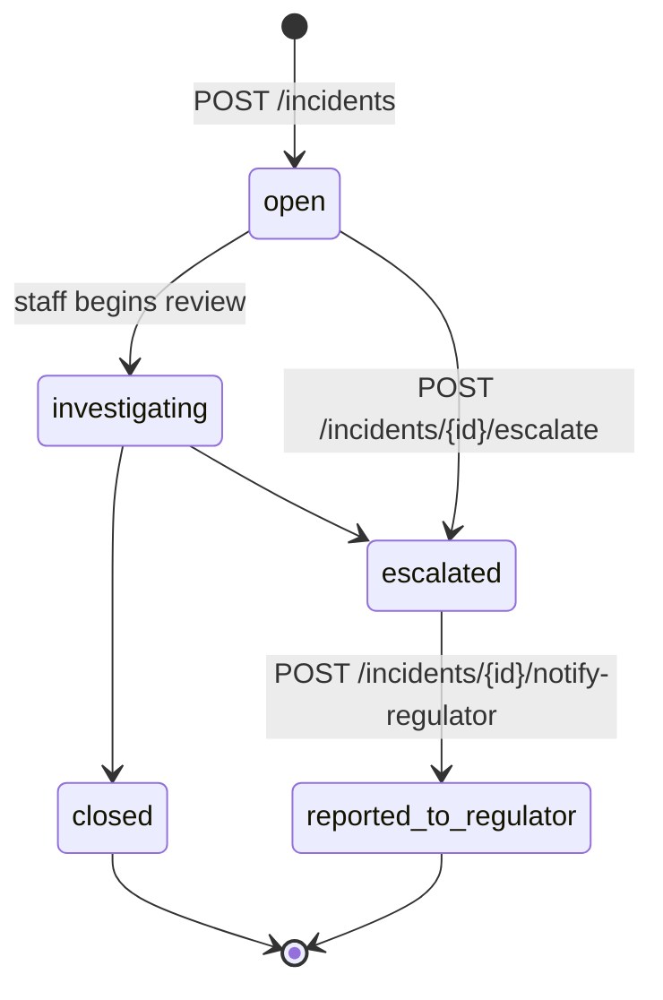

# Incidents

Falls, medication errors, abuse allegations, restraint events, deaths,
complaints — anything a regulator might ask about. The incidents module
captures the event, classifies it under the relevant regulator scheme,
stamps a notification deadline, and tracks the workflow through review →
escalation → regulator notification.

Permissions: read = `view_all_patients ∪ view_own_patients ∪ manage_patients`,
create/update = `manage_patients`, escalate / notify regulator =
`generate_audit_export`.

---

## Lifecycle



Status transitions live in the service layer. Escalation requires a
documented reason — audit defensibility hinges on the *why*, not just
the fact of the escalation.

---

## SIRS / CQC classifier

Vertical- and country-aware. Pure function (`incidents.Classify`) called
at insert time; no I/O. Returns:

```go
type Classification struct {
    SIRSPriority         string     // "priority_1" | "priority_2" | ""
    CQCNotifiable        bool
    CQCNotificationType  string     // "Reg 16 — …" / "Reg 18 — …"
    NotificationDeadline *time.Time // absolute cut-off
    Reason               string     // human-readable
}
```

### Aged care AU (ACQSC SIRS)

Reference: Aged Care Quality and Safety Commission Rules 2018,
Serious Incident Response Scheme.

| Trigger | Priority | Deadline |
|---|---|---|
| `physical_abuse` · `sexual_misconduct` · `psychological_abuse` · `financial_abuse` · `neglect` · `restraint` · `unauthorised_absence` · `unexplained_injury` | **P1** | occurred + **24h** |
| `death` with severity `critical`/`high` and outcome `deceased` | **P1** | occurred + 24h |
| Outcome `hospitalised` OR severity `critical` | **P1** | occurred + 24h |
| Other reportable types (`fall`, `medication_error`, etc.) | **P2** | occurred + **30d** |
| Anything else | none | none |

### Aged care UK (CQC notifiable)

Reference: Care Quality Commission Regulations 2009 (as amended).

| Trigger | Citation | Deadline |
|---|---|---|
| `death` | Reg 16 | occurred + 24h |
| `unexplained_injury` · `unauthorised_absence` | Reg 18 | occurred + 24h |
| Abuse types (`sexual_misconduct`, `physical_abuse`, `psychological_abuse`, `financial_abuse`, `neglect`) | Reg 18 (allegation of abuse) | occurred + 24h |
| `restraint` | Reg 17 (deprivation of liberty) | occurred + 24h |
| Outcome `hospitalised` / `deceased` OR severity `critical` (catch-all) | Reg 18 (other incident) | occurred + 24h |

### Other combos

Vet / dental / general — and aged care NZ/US — return zero-value
`Classification` in v1. The incident is recorded for internal audit;
no regulator scheme auto-triggers. Adding a scheme is a registry-style
change in `internal/incidents/classifier.go`.

### Tests

Eight unit tests in `classifier_test.go` cover the load-bearing rules:

- Abuse types → P1 regardless of severity
- Hospitalisation bumps a fall to P1
- Fall + no harm → P2 (30d)
- Country isolation (NZ doesn't trigger AU-only SIRS)
- Reg 16 (death) vs Reg 18 (abuse / serious injury) differentiation
- Hospitalised non-abuse fall in UK → Reg 18
- Vet/dental/general/aged-care-US → no auto-classification
- Vertical alias normalisation (`veterinary` ≡ `vet`, etc.)

---

## Database

Migration: `00055_create_incident_events.sql`. Three tables:

- `incident_events` — main row. Includes SIRS priority, CQC notifiable
  flag + reg type, deadline, escalation chain, regulator reference number
  (set when externally notified), preventive plan summary.
- `incident_witnesses` — M:M staff witnesses. Distinct from the
  free-text `witnesses_text` column on the main table.
- `incident_addendums` — append-only log for late-arriving information.
  Original incident description never changes; corrections live here.

A partial index `incident_events_pending_notification_idx` supports the
deadline-countdown sweep used by D3 alerts.

---

## API surface

```
POST   /api/v1/incidents                       (manage_patients)
GET    /api/v1/incidents                       (view ∪ manage)
GET    /api/v1/incidents/{id}                  (view ∪ manage)
PATCH  /api/v1/incidents/{id}                  (manage_patients)
POST   /api/v1/incidents/{id}/escalate         (generate_audit_export)
POST   /api/v1/incidents/{id}/notify-regulator (generate_audit_export)
POST   /api/v1/incidents/{id}/witnesses        (manage_patients)
DELETE /api/v1/incidents/{id}/witnesses/{staff_id} (manage_patients)
POST   /api/v1/incidents/{id}/addendums        (manage_patients)
POST   /api/v1/incidents/ai-draft              (manage_patients · only when AI provider configured)
```

`POST /api/v1/incidents` runs the classifier server-side. The Flutter
modal can also POST `/ai-draft` first to extract typed fields from a
free-text or audio-transcribed account; the clinician edits before
submitting via the regular create endpoint. SIRS / CQC classification
runs on the **final committed values**, so AI suggestions never bypass
the regulator-decision logic.
