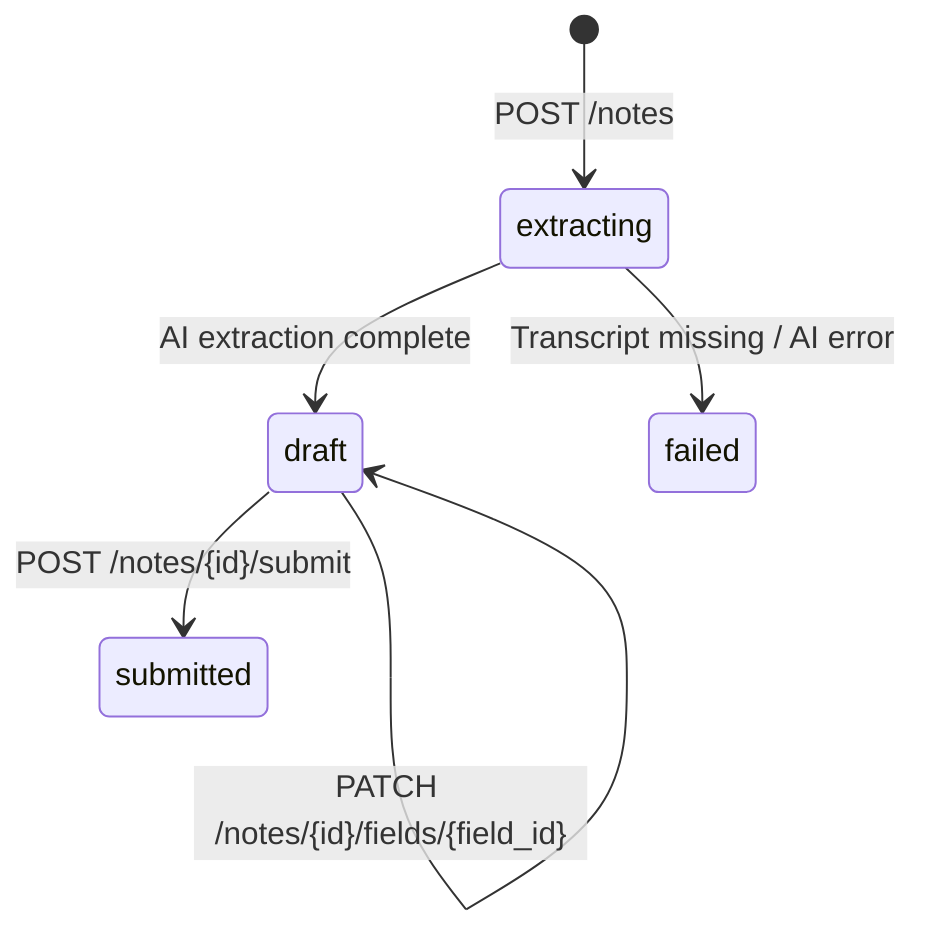

# Notes & Extraction

A **Note** is the output of running AI extraction over a recording using a specific published form version.
One note = one recording + one form version. Staff review extracted fields and submit the note to lock it.

## Lifecycle



| Status | Description |
|---|---|
| `extracting` | River job is running; poll GET /notes/{id} until status changes |
| `draft` | Extraction done; fields ready for staff review and override |
| `failed` | Extraction failed; `error_message` explains why |
| `submitted` | Locked; no further edits allowed |

## Recording cap

Maximum **3 notes per recording**. Enforced at service layer (`CountNotesByRecording`).
Returns `409 Conflict` if exceeded.

## AI Extraction flow

```
POST /notes
  → creates note (status=extracting)
  → enqueues River job ExtractNoteArgs{NoteID}

ExtractNoteWorker.Work()
  → GetNoteByID (no clinic check — internal)
  → GetTranscript (audio.Repository)
  → GetFieldsByVersionID (forms.Repository via adapter)
  → build FieldSpec list (skip skippable fields)
  → Extractor.Extract(transcript, specs)
  → UpsertNoteFields (AI results + null rows for skippable)
  → UpdateNoteStatus → draft
```

If no extractor is configured (no API key), the worker skips AI and immediately sets `draft`
so staff can fill fields manually.

## Field values

Each extracted field in `note_fields` stores:

| Column | Description |
|---|---|
| `value` | JSON-encoded extracted value (string, number, boolean, null) |
| `confidence` | AI confidence 0.0–1.0 |
| `source_quote` | Verbatim transcript snippet that justified the value |
| `overridden_by` | Staff UUID who manually changed the value |
| `overridden_at` | When the override was recorded |

Skippable fields get a `null` value row so they appear in the review screen.

## Extraction providers

Configured via `EXTRACTION_PROVIDER` env var (default: `gemini`).

| Provider | Env var | Notes |
|---|---|---|
| `gemini` | `GEMINI_API_KEY` | Gemini 2.5 Flash, free tier available, used in dev |
| `openai` | `OPENAI_API_KEY` | Stub — not yet implemented |

If no key is set for the configured provider, extraction is disabled (worker skips AI).

The `Extractor` interface (`internal/extraction/extractor.go`):

```go
type Extractor interface {
    Extract(ctx context.Context, transcript, overallPrompt string, fields []FieldSpec) ([]FieldResult, error)
}
```

## Cross-module wiring

Notes needs data from two other modules. To avoid direct imports, the `notes` package
defines provider interfaces implemented by adapters in `app.go`:

| Interface | Adapter | Backed by |
|---|---|---|
| `FormFieldProvider` | `formsFieldAdapter` | `forms.Repository.GetFieldsByVersionID` |
| `RecordingProvider` | `audioTranscriptAdapter` | `audio.Repository.GetTranscript` |

## Database tables

### `notes`

| Column | Type | Notes |
|---|---|---|
| `id` | UUID | UUIDv7 PK |
| `clinic_id` | UUID | FK → clinics |
| `recording_id` | UUID | FK → recordings |
| `form_version_id` | UUID | FK → form_versions |
| `subject_id` | UUID? | Optional patient link |
| `created_by` | UUID | Staff who created the note |
| `status` | TEXT | extracting / draft / submitted / failed |
| `error_message` | TEXT? | Set on failed status |
| `submitted_at` | TIMESTAMPTZ? | Set on submit |
| `submitted_by` | UUID? | Staff who submitted |

Unique index on `(recording_id, form_version_id)` — one note per recording+form combination.

### `note_fields`

| Column | Type | Notes |
|---|---|---|
| `id` | UUID | UUIDv7 PK |
| `note_id` | UUID | FK → notes |
| `field_id` | UUID | FK → form_fields |
| `value` | TEXT? | JSON-encoded |
| `confidence` | DECIMAL(5,2)? | AI confidence |
| `source_quote` | TEXT? | Supporting transcript excerpt |
| `overridden_by` | UUID? | Staff override author |
| `overridden_at` | TIMESTAMPTZ? | Override timestamp |

Unique on `(note_id, field_id)`. Ordered by `form_fields.position` in GET responses.

## Endpoints

| Method | Path | Permission | Description |
|---|---|---|---|
| POST | `/api/v1/notes` | SubmitForms | Create note + enqueue extraction |
| GET | `/api/v1/notes` | SubmitForms | List notes (filter by recording_id, subject_id, status) |
| GET | `/api/v1/notes/{note_id}` | SubmitForms | Get note with all field values |
| PATCH | `/api/v1/notes/{note_id}/fields/{field_id}` | SubmitForms | Override a field value (draft only) |
| POST | `/api/v1/notes/{note_id}/submit` | SubmitForms | Submit note (draft → submitted) |

### Create note

```http
POST /api/v1/notes
Authorization: Bearer <token>

{
  "recording_id": "uuid",
  "form_version_id": "uuid",
  "subject_id": "uuid"  // optional
}
```

### Override a field

```http
PATCH /api/v1/notes/{note_id}/fields/{field_id}
Authorization: Bearer <token>

{
  "value": "\"corrected value\""  // JSON-encoded; null to clear
}
```

### Get note (poll for extraction)

```http
GET /api/v1/notes/{note_id}
Authorization: Bearer <token>
```

Poll until `status` is `draft` or `failed`. Response includes `fields` array with AI values
and confidence scores.
