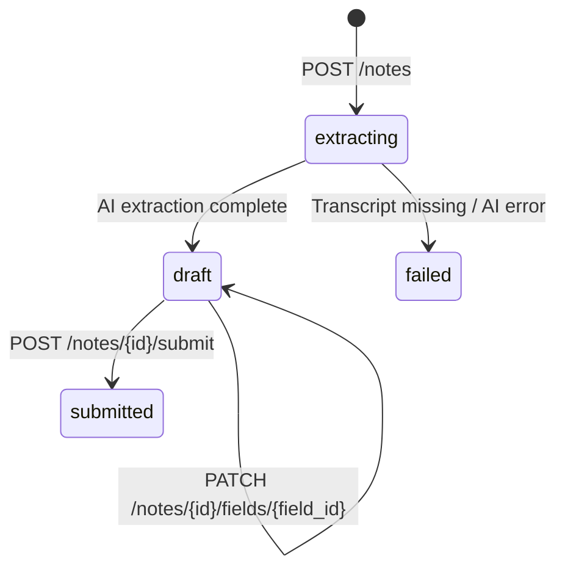

# Notes & Extraction

A **Note** is the output of running AI extraction over a recording using a specific published form version.
One note = one recording + one form version. Staff review extracted fields and submit the note to lock it.

## Lifecycle



| Status | Description |
|---|---|
| `extracting` | River job is running; poll GET /notes/{id} until status changes |
| `draft` | Extraction done; fields ready for staff review and override |
| `failed` | Extraction failed; `error_message` explains why |
| `submitted` | Locked; no further edits allowed |

## Recording cap

Maximum **3 notes per recording**. Enforced at service layer (`CountNotesByRecording`).
Returns `409 Conflict` if exceeded.

## AI Extraction flow

```
POST /notes
  → creates note (status=extracting)
  → enqueues River job ExtractNoteArgs{NoteID}

ExtractNoteWorker.Work()
  → GetNoteByID (no clinic check — internal)
  → GetTranscript (audio.Repository)
  → GetWordConfidences (audio.Repository — nil for GeminiTranscriber)
  → GetFieldsByVersionID (forms.Repository via adapter)
  → build FieldSpec list (skip skippable fields)
  → Extractor.Extract(transcript, specs)
  → for each result: confidence.ComputeFieldConfidence(source_quote, word_index)
  → UpsertNoteFields (AI results + deterministic confidence + null rows for skippable)
  → UpdateNoteStatus → draft
```

If no extractor is configured (no API key), the worker skips AI and immediately sets `draft`
so staff can fill fields manually. In both cases a `ComputePolicyAlignmentArgs` job is
enqueued immediately after so the alignment score appears in the review screen.

### Race-free transcript handoff

Extraction needs the transcript that the parallel `TranscribeAudioWorker`
produces. Earlier versions papered over the race with
`river.InsertOpts{ScheduledAt: now + 8s}` — a guess at "transcribe usually
finishes faster than that". The current design replaces the guess with two
deterministic backstops:

1. **Audio-side fan-out.** `audio.TranscribeAudioWorker` accepts a slice
   of `audio.TranscriptListener` and calls every listener after persisting
   the transcript. `notes.Service.OnRecordingTranscribed` re-enqueues
   `ExtractNoteArgs` for any note in `extracting` status bound to that
   recording. The wiring lives in `app.go` via a `lazyTranscriptListener`
   because the audio worker is registered before notes.Service exists.
2. **Worker-side snooze.** When `ExtractNoteWorker` runs and the
   transcript still isn't ready, it returns
   `&rivertype.JobSnoozeError{Duration: 3 * time.Second}` rather than a
   plain error — fast retry, ~3 s instead of the default ~60 s exponential
   backoff. Backstop for cases where the listener didn't fire (e.g.
   transcribe worker crashed mid-fan-out).

`river.InsertOpts.UniqueOpts{ByArgs: true}` collapses both enqueue paths
to a single in-flight job per `(kind, NoteID)`, so the worker only runs
once per outcome.

The listener interface is shared with the AI drafts module (incidents,
consent) — see `docs/ai_drafts.md`.

### Deterministic confidence scoring

After the LLM returns results, the worker computes a deterministic confidence score for each
field by aligning the `source_quote` back to the Deepgram word-level data:

1. **Exact match** — normalised `source_quote` found verbatim in the normalised transcript → score 1.0.
2. **Fuzzy match** — sliding-window LCS-ratio search; score 0.60–1.0 → `grounding_source="fuzzy"`.
3. **Ungrounded** — score below 0.60; quote not found → `asr_confidence=0`, `requires_review=true`.
4. **No ASR data** — GeminiTranscriber was used; ASR columns stay `NULL`, LLM confidence kept as-is.

An `"inference"` `transformation_type` (LLM derived a value rather than quoting verbatim)
applies an additional 0.85× penalty to reflect the extra reasoning step.

See `docs/deterministic_confidence.md` and `internal/platform/confidence/confidence.go` for full details.

## Policy alignment score

After extraction (and again after submission), a `ComputePolicyAlignmentWorker` River job
scores how well the note's field values satisfy the linked form's policy clauses:

```
ComputePolicyAlignmentWorker.Work()
  → GetNoteByID
  → GetClausesForNote (form_policies → latest published policy version → policy_clauses)
  → GetNoteFields + GetFieldsByVersionID (build "title: value" content string)
  → PolicyAligner.AlignPolicy(content, clauses) → Gemini scores each clause satisfied/not
  → weighted score: high=3× medium=2× low=1×
  → UpdatePolicyAlignment → notes.policy_alignment_pct
```

The score is surfaced in `NoteResponse.policy_alignment_pct` (null until the job runs, or when
the form has no linked policies with published clauses).

Only Gemini supports `PolicyAligner`; OpenAI returns nil and the worker skips silently.

## Field values

Each extracted field in `note_fields` stores:

| Column | Description |
|---|---|
| `value` | JSON-encoded extracted value (string, number, boolean, null) |
| `confidence` | LLM-estimated confidence 0.0–1.0 (fallback when no ASR data) |
| `source_quote` | Verbatim transcript snippet that justified the value |
| `transformation_type` | `"direct"` (verbatim quote) or `"inference"` (LLM derived the value) |
| `asr_confidence` | Mean ASR word confidence for the matched span (NULL when no Deepgram data) |
| `min_word_confidence` | Minimum word confidence in span — used as the review trigger |
| `alignment_score` | Quote-to-transcript match quality (1.0=exact, NULL when no ASR data) |
| `grounding_source` | `"exact"` \| `"fuzzy"` \| `"ungrounded"` \| `"no_asr_data"` |
| `requires_review` | `true` when grounding_source=`"ungrounded"` (possible hallucination) |
| `overridden_by` | Staff UUID who manually changed the value |
| `overridden_at` | When the override was recorded |

Skippable fields get a `null` value row so they appear in the review screen.

## Extraction providers

Configured via `EXTRACTION_PROVIDER` env var (default: `gemini`).

| Provider | Env var | Notes |
|---|---|---|
| `gemini` | `GEMINI_API_KEY` | Gemini 2.5 Flash, ResponseSchema + ThinkingBudget=0, free tier, used in dev |
| `openai` | `OPENAI_API_KEY` | GPT-4.1-mini, strict JSON schema mode |

If no key is set for the configured provider, extraction is disabled (worker skips AI, note goes straight to `draft`).

The `Extractor` interface (`internal/extraction/extractor.go`):

```go
type Extractor interface {
    Extract(ctx context.Context, transcript, overallPrompt string, fields []FieldSpec) ([]FieldResult, error)
}
```

## Cross-module wiring

Notes needs data from several other modules. To avoid direct imports, the `notes` package
defines provider interfaces implemented by adapters in `app.go`:

| Interface | Adapter | Backed by |
|---|---|---|
| `FormFieldProvider` | `formsFieldAdapter` | `forms.Repository.GetFieldsByVersionID` |
| `RecordingProvider` | `audioTranscriptAdapter` | `audio.Repository.GetTranscript` + `GetWordConfidences` |
| `PolicyClauseProvider` | `policyClauseProviderAdapter` | `forms.Repository.ListLinkedPolicies` + `policy.Repository.ListClauses` |

## Database tables

### `notes`

| Column | Type | Notes |
|---|---|---|
| `id` | UUID | UUIDv7 PK |
| `clinic_id` | UUID | FK → clinics |
| `recording_id` | UUID | FK → recordings |
| `form_version_id` | UUID | FK → form_versions |
| `subject_id` | UUID? | Optional patient link |
| `created_by` | UUID | Staff who created the note |
| `status` | TEXT | extracting / draft / submitted / failed |
| `error_message` | TEXT? | Set on failed status |
| `submitted_at` | TIMESTAMPTZ? | Set on submit |
| `submitted_by` | UUID? | Staff who submitted |
| `policy_alignment_pct` | DECIMAL(5,2)? | Weighted alignment score 0–100; null until job runs |

Unique index on `(recording_id, form_version_id)` — one note per recording+form combination.

### `note_fields`

| Column | Type | Notes |
|---|---|---|
| `id` | UUID | UUIDv7 PK |
| `note_id` | UUID | FK → notes |
| `field_id` | UUID | FK → form_fields |
| `value` | TEXT? | JSON-encoded |
| `confidence` | DECIMAL(5,2)? | LLM-estimated confidence (fallback) |
| `source_quote` | TEXT? | Supporting transcript excerpt |
| `transformation_type` | VARCHAR(20)? | `"direct"` or `"inference"` |
| `asr_confidence` | DECIMAL(5,4)? | Mean ASR word confidence for matched span |
| `min_word_confidence` | DECIMAL(5,4)? | Minimum word confidence in span |
| `alignment_score` | DECIMAL(5,4)? | Quote-to-transcript match quality |
| `grounding_source` | VARCHAR(20)? | `"exact"` / `"fuzzy"` / `"ungrounded"` / `"no_asr_data"` |
| `requires_review` | BOOLEAN | `true` when grounding_source=`"ungrounded"` |
| `overridden_by` | UUID? | Staff override author |
| `overridden_at` | TIMESTAMPTZ? | Override timestamp |

Unique on `(note_id, field_id)`. Ordered by `form_fields.position` in GET responses.
Index `idx_note_fields_review` on `(note_id) WHERE requires_review = TRUE` for fast review-queue queries.

## Endpoints

| Method | Path | Permission | Description |
|---|---|---|---|
| POST | `/api/v1/notes` | SubmitForms | Create note + enqueue extraction |
| GET | `/api/v1/notes` | SubmitForms | List notes (filter by recording_id, subject_id, status) |
| GET | `/api/v1/notes/{note_id}` | SubmitForms | Get note with all field values |
| PATCH | `/api/v1/notes/{note_id}/fields/{field_id}` | SubmitForms | Override a field value (draft only) |
| POST | `/api/v1/notes/{note_id}/submit` | SubmitForms | Submit note (draft → submitted) |

### Create note

```http
POST /api/v1/notes
Authorization: Bearer <token>

{
  "recording_id": "uuid",
  "form_version_id": "uuid",
  "subject_id": "uuid"  // optional
}
```

### Override a field

```http
PATCH /api/v1/notes/{note_id}/fields/{field_id}
Authorization: Bearer <token>

{
  "value": "\"corrected value\""  // JSON-encoded; null to clear
}
```

### Get note (poll for extraction)

```http
GET /api/v1/notes/{note_id}
Authorization: Bearer <token>
```

Poll until `status` is `draft` or `failed`. Response includes `fields` array with AI values
and confidence scores.

## System widgets — typed compliance fields

Forms can include `system.*` fields that capture into typed ledger
tables instead of free-text. Four kinds today:

| Field type | Ledger table | id-pointer key |
|---|---|---|
| `system.consent` | `consent_records` | `consent_id` |
| `system.drug_op` | `drug_operations_log` | `operation_id` |
| `system.incident` | `incident_events` | `incident_id` |
| `system.pain_score` | `pain_scores` | `pain_score_id` |

The AI extracts a typed JSON suggestion (drug name, score, severity, …)
into `note_fields.value`. The clinician then **materialises** the field
via a per-type endpoint — that creates the ledger row and writes an
id-pointer JSON (e.g. `{"pain_score_id":"<uuid>"}`) back into
`note_fields.value`. The id-pointer marks the field as materialised;
`IsMaterialisedValue` in `notes/materialise.go` is the canonical check.

Architecturally:

- `notes/materialise.go` defines four adapter interfaces — `Consent`,
  `DrugOp`, `Incident`, `Pain` `Materialiser` — wired via
  `Service.SetSystemMaterialisers` from `app.go`. Notes never imports
  the entity packages directly; the adapters bridge into each domain's
  service.
- A parallel set of read-side interfaces — `*Summariser` — wired via
  `Service.SetSystemSummarisers` resolves a materialised
  `note_fields.value` into a small labelled summary
  (`SystemSummaryItem{label,value}` rows). `GetNote` enriches every
  materialised field's `system_summary` so the FE card and the PDF
  render captured data instead of raw id JSON.
- The PDF renderer (`notes/pdf.go`, `notes/jobs.go`) calls back into
  the same summarisers and emits a labelled key/value block in place
  of the raw value for any `system.*` field.

### Materialise endpoints

All four are idempotent — calling on an already-materialised field
returns the existing entity reference without re-creating.

| Method | Path | Permission |
|---|---|---|
| POST | `/api/v1/notes/{note_id}/fields/{field_id}/materialise-consent` | ManagePatients |
| POST | `/api/v1/notes/{note_id}/fields/{field_id}/materialise-drug-op` | Dispense |
| POST | `/api/v1/notes/{note_id}/fields/{field_id}/materialise-incident` | ManagePatients |
| POST | `/api/v1/notes/{note_id}/fields/{field_id}/materialise-pain-score` | ManagePatients OR Dispense |

Each request body is the typed payload for that entity (see
`handler_materialise.go`). The handler validates path UUIDs, the service
loads the form field via `GetNoteFieldWithType` (LEFT JOIN on
`note_fields` so a never-extracted system widget can still be captured
manually), checks the field type matches the expected `system.*` kind,
calls the adapter, and writes the id-pointer back via
`WriteMaterialisedPointer` (UPSERT — creates the `note_fields` row when
the AI didn't produce one).

### Submit gate

`POST /api/v1/notes/{note_id}/submit` rejects when any `system.*` field
on the note holds a non-id-pointer value. The error name lists the
pending widgets so the FE can highlight them. Standalone field with no
value at all is allowed (the user simply chose not to capture); only a
non-null **AI payload** (the pre-materialise JSON) blocks submit.

### Patient-timeline gating

Compliance entities are visible on the patient timeline / 30-day trend
/ reconciliation math only when their parent note is `submitted` (or
when there is no parent note at all — standalone capture). The
list/aggregate repos in `consent`, `drugs`, `incidents`, `pain` enforce:

```sql
AND (note_id IS NULL OR note_id IN (SELECT id FROM notes WHERE status = 'submitted'))
```

Per-id GETs are unconditional so the note review surface can still
render its own pending materialisations. The gate covers
`ListConsents`, `ListOperations`, `ListIncidents`, `ListPainScores`,
`SubjectTrend`, and `SumLedgerForShelfPeriod`.

### Caller responsibilities

- **Submit-gate awareness:** the FE must surface the
  `unmaterialised system widgets` validation error and route the user
  back to the cards before submit is retried.
- **Idempotency:** retrying materialise after a transient error is
  safe — the second call returns the existing id-pointer.
- **Tenant safety:** `GetNoteFieldWithType` short-circuits with
  `ErrNotFound` when the note doesn't belong to the caller's clinic.
  All adapter interfaces receive `clinic_id` from the service so each
  domain can re-validate.
