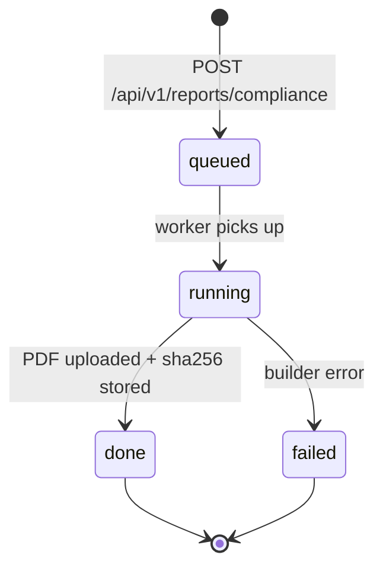

# Compliance Reports

The reports module sits in two layers, both gated on the
`generate_audit_export` permission:

1. **CSV exports** (the original layer, documented below). Asynchronous
   queries over the `note_events` audit log → CSV file in storage.
   Backed by the `report_jobs` table.
2. **Compliance PDFs** (added in A4 — see [Compliance reports
   (regulator-facing PDFs)](#compliance-reports-regulator-facing-pdfs)).
   Vertical- and country-agnostic, regulator-formatted artefacts (Audit
   Pack, Controlled Drugs Register). Backed by the `reports` +
   `report_audit` tables (migration 00061).

Both layers live in the same Go package (`internal/reports`) and share
the same handler / service / repo files; the routes split under
`/api/v1/reports/...` (CSV) and `/api/v1/reports/compliance/...` (PDFs).

---

## Report types

| Report | Description | Key filter |
|---|---|---|
| **Clinical audit** | All note events for the clinic | Date range, staff, subject |
| **Staff actions** | All events performed by a specific staff member | `staff_id` (required) |
| **Note history** | Full event trail for a single note, oldest first | `note_id` (path param) |
| **Consent log** | All `note.submitted` events — the sign-off record | Date range, subject |

All reports query the `note_events` table only — no joins to other tables. The consent log uses `event_type = 'note.submitted'` to isolate submission events; `actor_id` is the reviewing staff member and `occurred_at` is the submission timestamp.

---

## Synchronous query endpoints

Return paginated JSON results suitable for in-app display. Max 100 rows per page.

### Clinical audit

```http
GET /api/v1/reports/clinical-audit
Authorization: Bearer <token>

?from=2026-01-01T00:00:00Z
&to=2026-03-31T23:59:59Z
&staff_id=<uuid>        # optional
&subject_id=<uuid>      # optional
&limit=20
&offset=0
```

### Staff actions

```http
GET /api/v1/reports/staff-actions
Authorization: Bearer <token>

?staff_id=<uuid>        # required
&from=...&to=...
&limit=20&offset=0
```

### Note history

```http
GET /api/v1/reports/note-history/{note_id}
Authorization: Bearer <token>
```

Returns the complete event trail for the note (no pagination — note history is always small).

### Consent log

```http
GET /api/v1/reports/consent-log
Authorization: Bearer <token>

?from=...&to=...
&subject_id=<uuid>      # optional
&limit=20&offset=0
```

---

## Async CSV export

For full-dataset exports (audits, regulatory submissions), use the async export flow:

### 1. Request export

```http
POST /api/v1/reports/export
Authorization: Bearer <token>
Content-Type: application/json

{
  "report_type": "clinical_audit",
  "format": "csv",
  "filters": {
    "from": "2026-01-01T00:00:00Z",
    "to": "2026-03-31T23:59:59Z",
    "staff_id": "<uuid>",       // optional
    "subject_id": "<uuid>",     // optional
    "note_id": "<uuid>"         // required for note_history type
  }
}
```

Returns `202 Accepted` with a job record:

```json
{
  "id": "<job_uuid>",
  "report_type": "clinical_audit",
  "format": "csv",
  "status": "pending",
  "created_at": "2026-04-14T10:00:00Z"
}
```

### 2. Poll for completion

```http
GET /api/v1/reports/export/{job_id}
Authorization: Bearer <token>
```

| Status | Meaning |
|---|---|
| `pending` | Job is queued, not yet started |
| `complete` | CSV ready; `download_url` contains a presigned S3 URL (valid 1 hour) |
| `failed` | Generation failed; `error_msg` explains why |

When `status=complete`:

```json
{
  "id": "<job_uuid>",
  "status": "complete",
  "download_url": "https://s3.../reports/<clinic_id>/<job_id>.csv?X-Amz-Expires=3600...",
  "completed_at": "2026-04-14T10:00:42Z"
}
```

The `download_url` is a **fresh presigned URL** generated on every GET — it is never stored in the database. The S3 key (`reports/{clinic_id}/{job_id}.csv`) is stored and used to generate the URL on demand.

---

## CSV format

All report types produce the same column layout:

| Column | Description |
|---|---|
| `occurred_at` | RFC3339 UTC timestamp |
| `event_type` | Event type string |
| `note_id` | UUID of the note |
| `subject_id` | UUID of the subject (blank if not linked) |
| `actor_id` | UUID of the staff member |
| `actor_role` | Role at the time of the event |
| `field_id` | UUID of the changed field (blank if not a field_changed event) |
| `old_value` | Previous value (blank if not applicable) |
| `new_value` | New value (blank if not applicable) |
| `reason` | Staff-provided reason (blank if not provided) |

Max rows per export: **50,000**. Larger exports should use date range filters to split into multiple jobs.

---

## Export job flow

```
POST /api/v1/reports/export
  → InsertReportJob (status=pending)
  → river.Insert(GenerateReportArgs)
  → return job record

GenerateReportWorker.Work()
  → fetchAll (queries note_events, max 50k rows)
  → writeCSV (in-memory buffer)
  → store.Upload(key="reports/{clinic_id}/{job_id}.csv")
  → repo.MarkComplete(key)

GET /api/v1/reports/export/{job_id}
  → GetReportJob
  → if complete: store.PresignDownload(key, 1 hour)
  → return job + download_url
```

---

## Database

Migration: `00013_create_report_jobs.sql`

```sql
CREATE TABLE report_jobs (
    id           UUID PRIMARY KEY,
    clinic_id    UUID NOT NULL,
    report_type  TEXT NOT NULL,
    format       TEXT NOT NULL DEFAULT 'csv',
    status       TEXT NOT NULL DEFAULT 'pending',
    filters      JSONB,
    storage_key  TEXT,          -- set on completion; used to generate presigned URL
    error_msg    TEXT,
    created_by   UUID NOT NULL,
    created_at   TIMESTAMPTZ NOT NULL DEFAULT NOW(),
    completed_at TIMESTAMPTZ
);
```

## Endpoint summary

| Method | Path | Description |
|---|---|---|
| `GET` | `/api/v1/reports/clinical-audit` | Paginated clinical audit |
| `GET` | `/api/v1/reports/staff-actions` | Paginated staff actions (staff_id required) |
| `GET` | `/api/v1/reports/note-history/{note_id}` | Full note event trail |
| `GET` | `/api/v1/reports/consent-log` | Paginated consent/submission log |
| `POST` | `/api/v1/reports/export` | Request async CSV export (202) |
| `GET` | `/api/v1/reports/export/{job_id}` | Poll export status + get download URL |

---

## Compliance reports (regulator-facing PDFs)

The PDF layer produces single-document artefacts a clinic can hand to
its regulator: an **Audit Pack** that summarises everything in one place,
and a **Controlled Drugs Register** in the format the regulator inspects.
Both are vertical- and country-agnostic by design — every type works for
every (vertical, country) we ship.

### Type registry

| Type slug | Output | What it contains |
|-----------|--------|------------------|
| `audit_pack` | PDF | Cover, records-activity counts, controlled-drug ledger highlights, reconciliations |
| `controlled_drugs_register` | PDF | Cover, per-drug shelf sections with ledger, reconciliations, statutory declaration |

Adding a new type is a one-line addition to
`SupportedComplianceReportTypes` plus a `case` in the worker dispatch
(`jobs.go::GenerateCompliancePDFWorker.buildPDF`) and an optional new
builder in `pdf.go`. No CHECK constraint on the DB column — the
allow-list is enforced in the service layer.

### Vertical-agnostic regulator context

The Controlled Drugs Register is **one universal builder** that adapts
to every regulator via a registry (`pdf.go::regulatorContexts`). The
register reads the clinic's `(vertical, country)` and looks up:

- `RegisterTitle` — cover title (e.g. *"VCNZ Controlled Drugs Register"*,
  *"Schedule 8 Drugs Register (AU Dental)"*).
- `RegulatorName` — full name in the declaration body.
- `CodeReference` — the legal citation (e.g. *"VCNZ Code of Professional
  Conduct + Misuse of Drugs Act 1975"*, *"21 CFR 1304"*, *"UK Misuse of
  Drugs Regulations 2001"*).
- `SignatoryRole` — who signs (e.g. *authorised veterinarian*, *DEA-registered
  prescriber*, *registered nurse manager*).
- `LicenseLabel` — what the practitioner number is called (e.g. *VCNZ
  Registration #*, *DEA #*, *AHPRA #*).

16 combos ship today (vet/dental/general/aged_care × NZ/AU/UK/US). New
combos are a one-line registry entry in `pdf.go` — no code path per
country.

### Lifecycle



### Endpoints

```http
POST /api/v1/reports/compliance
Authorization: Bearer <token>
Content-Type: application/json

{
  "type": "controlled_drugs_register",
  "period_start": "2026-04-01T00:00:00Z",
  "period_end":   "2026-04-30T23:59:59Z"
}
```

Returns `202 Accepted` with the queued report row. Vertical + country
are stamped from the clinic record; clients don't (and can't) pass
them.

```http
GET  /api/v1/reports/compliance                  # paginated list
GET  /api/v1/reports/compliance/{id}             # single row
GET  /api/v1/reports/compliance/{id}/download    # row + presigned URL (1h)
```

The download endpoint:

1. Re-reads the row.
2. Returns `409 Conflict` if `status != "done"`.
3. Mints a fresh presigned URL via `storage.PresignDownload(key, 1h)`.
4. Appends a `downloaded` row to `report_audit` (append-only, regulator
   visibility).
5. Returns the row enriched with `download_url`.

### Worker pipeline

```
POST /api/v1/reports/compliance
  → CreateComplianceReport (status=queued)
  → river.Insert(GenerateCompliancePDFArgs{ReportID, ClinicID})

GenerateCompliancePDFWorker.Work()
  → GetComplianceReportInternal(id)
  → MarkComplianceReportRunning
  → ComplianceDataSource.GetClinic(clinicID) → ClinicSnapshot
  → dispatch by type:
      controlled_drugs_register:
        ListControlledDrugOps(period)
        ListReconciliationsInPeriod(period)
        BuildControlledDrugsRegisterPDF(...)
      audit_pack:
        ListControlledDrugOps + ListReconciliationsInPeriod + CountNotesByStatus
        BuildAuditPackPDF(...)
  → store.Upload("compliance-reports/{clinic_id}/{report_id}.pdf")
  → MarkComplianceReportDone(id, key, size, sha256)
```

`ComplianceDataSource` is a narrow adapter interface (in
`reports/pdf.go`) — `clinic.Service`, `staff.Service`, and `drugs.Service`
are wrapped behind it so reports doesn't import their types directly.
The reports-local view types (`DrugOpView`, `DrugReconciliationView`,
`ClinicSnapshot`) are reports' own. The wiring is in
`app.go::complianceDataAdapter` plus `lazyComplianceData` (the worker
is registered before the underlying services exist).

### Tamper detection

Every generated PDF is hashed (`sha256`) at build time. The hash is
stored in `reports.report_hash` and rendered in the cover page footer.
Anyone holding the file can re-hash it and compare against the row to
detect mutation. Combined with the append-only `report_audit` (which
captures every download), this gives the regulator a chain of custody
without us holding the file plaintext outside the storage tier.

### Database

Migration: `00061_create_reports.sql`. Two tables:

- `reports` — one row per compliance report. Status state machine
  (`queued`/`running`/`done`/`failed`) + denormalised vertical/country
  + file metadata (key, size, sha256). External-share token columns
  exist but are unused in v1.
- `report_audit` — append-only log of `generated`/`downloaded`/
  `shared_externally`/`deleted` events per report. UPDATE forbidden;
  the insert is the only mutation.

### Endpoint summary

| Method | Path | Description |
|---|---|---|
| `POST` | `/api/v1/reports/compliance` | Request a PDF (queued). Returns 202 + report row. |
| `GET` | `/api/v1/reports/compliance` | List clinic reports (filter by type / status / period). |
| `GET` | `/api/v1/reports/compliance/{id}` | Get one report. |
| `GET` | `/api/v1/reports/compliance/{id}/download` | Row + 1h presigned URL; appends to `report_audit`. |

### What's not done yet

- `download_url` on the list endpoint is empty — only the explicit
  `/download` route mints + audits one. Intentional: surfacing a URL
  on every list response would log spurious "downloaded" rows.
- AI-narrated reports (e.g. period summary with claimed insights) —
  belongs to the C3 phase.
- Email delivery + scheduled regeneration — D2 / D3.
- Notes-by-status counts in the Audit Pack are a v1 stub (returns an
  empty map). Wire to a `notes.Service.CountByStatus` method once the
  notes module exposes one.
- Override drugs aren't included in the Controlled Drugs Register —
  override entries don't carry `Controls` metadata yet (drugs module v1
  treats them as non-controlled).
